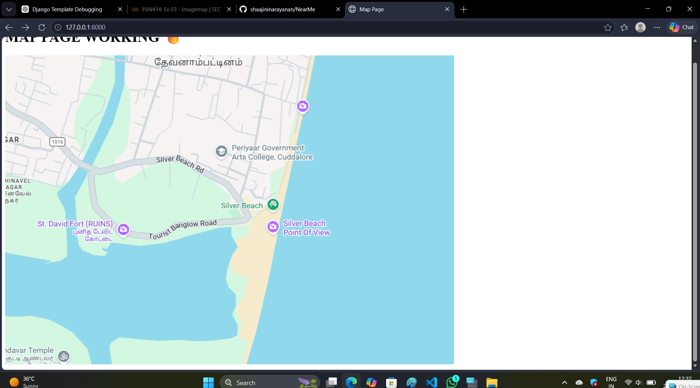
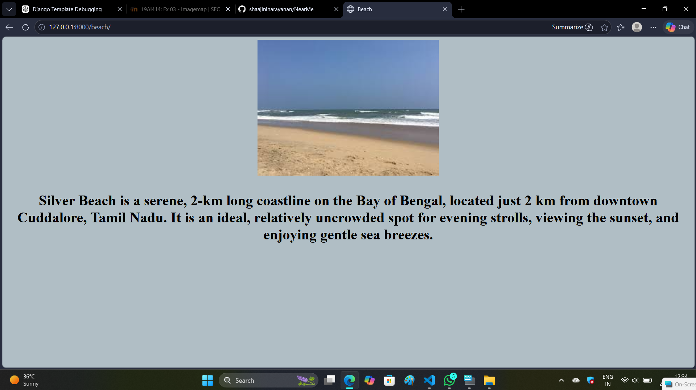
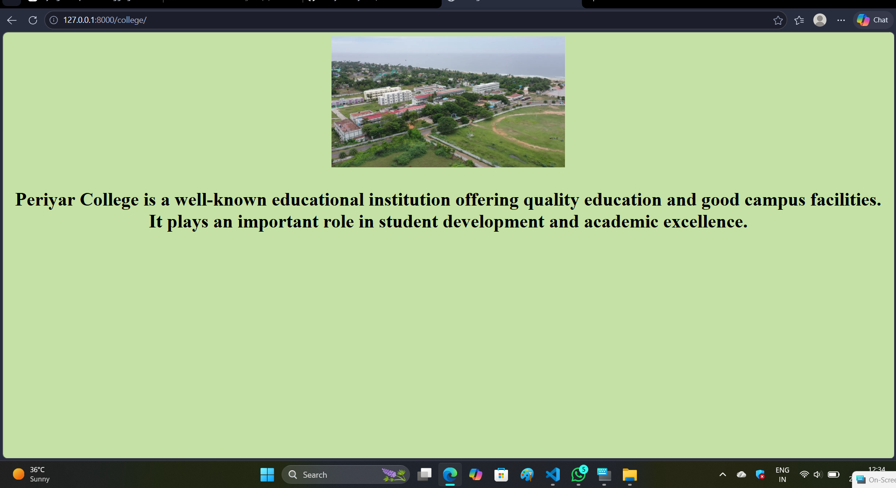
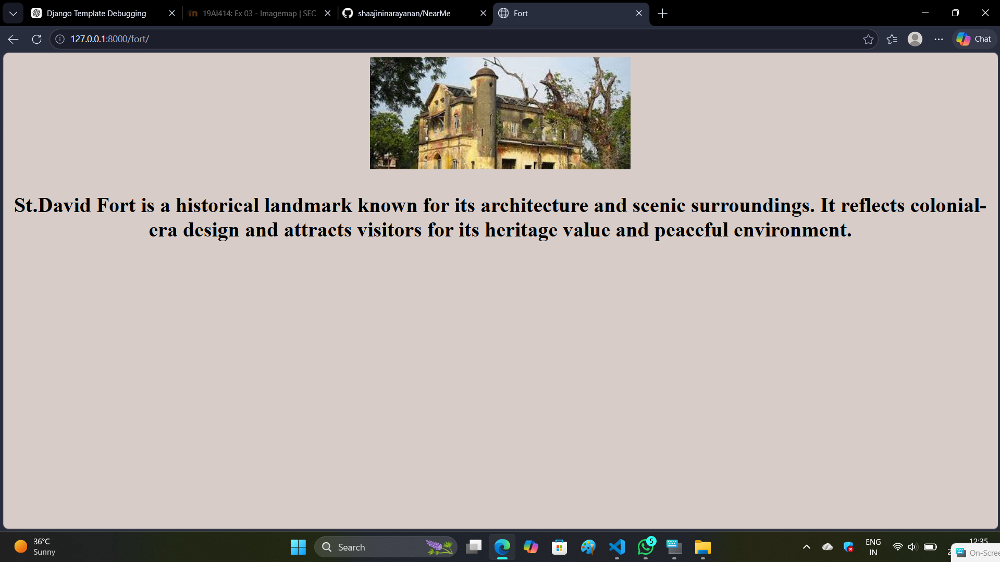

# Ex03 Places Around Me
## Date: 

## AIM
To develop a website to display details about the places around my house.

## DESIGN STEPS

### STEP 1
Create a Django admin interface.

### STEP 2
Download your city map from Google.

### STEP 3
Using ```<map>``` tag name the map.

### STEP 4
Create clickable regions in the image using ```<area>``` tag.

### STEP 5
Write HTML programs for all the regions identified.

### STEP 6
Execute the programs and publish them.

## CODE
map.html
```
<!DOCTYPE html>
<html lang="en">
<head>
    <meta charset="UTF-8">
    <title>Map</title>
</head>

<body>

<h1>TEST</h1>


<map name="image-map">

    <area alt="Davi fort" title="Davi fort"
          coords="37,312,291,453" shape="rect"
          href="javascript:void(0)" onclick="show('fort')">

    <area alt="Silver Beach" title="Silver Beach"
          coords="570,406,104" shape="circle"
          href="javascript:void(0)" onclick="show('beach')">

    <area alt="Periyar college" title="Periyar college"
          coords="416,233,583,245,705,249,609,110,488,118,416,229" shape="poly"
          href="javascript:void(0)" onclick="show('college')">

</map>

<div id="beach" style="display:none;">
    <h2>🌊 Beach Page</h2>
</div>

<div id="fort" style="display:none;">
    <h2>🏰 Fort Page</h2>
</div>

<div id="college" style="display:none;">
    <h2>🎓 College Page</h2>
</div>

<script>
function show(id){
    document.getElementById("beach").style.display="none";
    document.getElementById("fort").style.display="none";
    document.getElementById("college").style.display="none";

    document.getElementById(id).style.display="block";
}
</script>

</body>
</html>
```
beach.html
```
!DOCTYPE html>
<html lang="en">
<head>
    <meta charset="UTF-8">
    <meta name="viewport" content="width=device-width, initial-scale=1.0">
    <title>Document</title>
</head>
<body bgcolor="b0bec5" align="center">
    
    <h1><p align="center">Silver Beach is a serene, 2-km long coastline on the Bay of Bengal, located just 2 km from downtown Cuddalore, Tamil Nadu. It is an ideal, relatively uncrowded spot for evening strolls, viewing the sunset, and enjoying gentle sea breezes.
    </p></h1>
</body>
</html>
```
fort.html
```
<!DOCTYPE html>
<html lang="en">
<head>
    <meta charset="UTF-8">
    <meta name="viewport" content="width=device-width, initial-scale=1.0">
    <title>Document</title>
</head>
<body bgcolor="b0bec5" align="center">
    
    <h1><p align="center">Fort St. David is a historic British maritime fort located on the banks of the Gadilam River in the coastal town of Cuddalore, Tamil Nadu, about 175 km south of Chennai. Named after the patron saint of Wales, it served as a major seat of East India Company power and the headquarters of South India during the 18th-century Anglo-French conflicts.
    </p></h1>
</body>
</html>
```
college.html
```
<!DOCTYPE html>
<html lang="en">
<head>
    <meta charset="UTF-8">
    <meta name="viewport" content="width=device-width, initial-scale=1.0">
    <title>Document</title>
</head>
<body bgcolor="b0bec5" align="center">
    
    <h1><p align="center">Periyar Arts College (formerly Periyar Government Arts College) in Cuddalore is a public higher education institution established in 1964. Located in Devanampattinam near Silver Beach, the fully funded government college offers various undergraduate, postgraduate, and doctoral programs affiliated with Thiruvalluvar University.
    </p></h1>
</body>
</html>
```

## OUTPUT




## RESULT
The program for implementing image maps using HTML is executed successfully.
